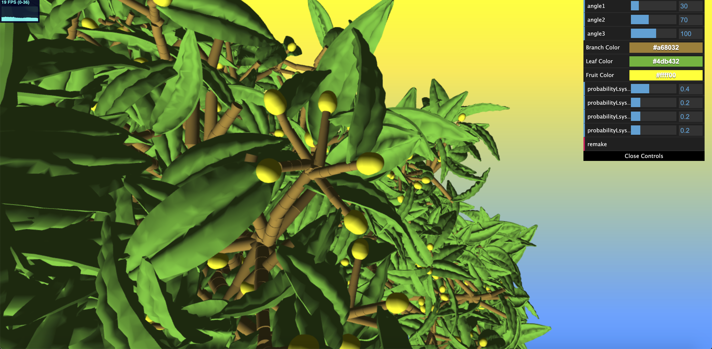
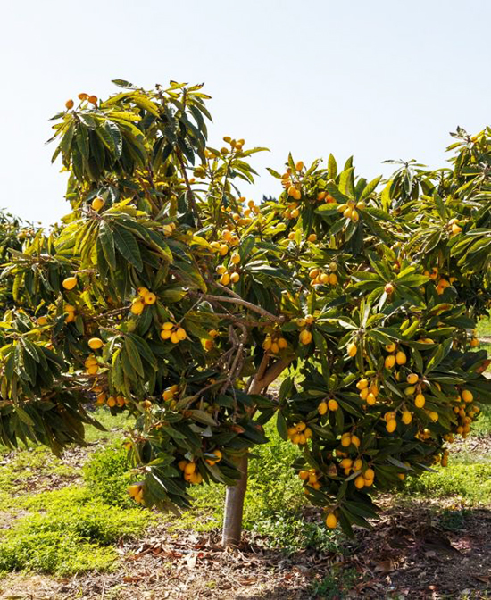

# CIS 566 Homework 4: L-systems
By Meggie Cheng (PennKey: meggie)

## Result
It's a loquat tree!
Link to live demo: https://tauntybird.github.io/hw04-l-systems/

Example render from front view:

Close-up view of end of a branch:

## Explanation
- I used a random number generator to help expand my LSystem string in unique ways. I also used a random number generator when drawing the LSystem, mainly to determine what degree to rotate around X, Y, and Z axis.
- The loquats are only drawn on the last possible recursion depth so that they are only drawn on ends of branches. The leaves are scattered on different locations along a branch but mostly branches that are near the last possible recursion depth (so you won't have leaves coming from the trunk).
- The modifiable variables include possible angles of rotation for branches: Z favors angle1 probabilistically, Y favors angle2 probabilistically, and X favors angle3 probabilistically. The colors are pretty self-explanatory. The 4 probabilities are for expanding the LSystem string. The first one makes the tree the bushiest (longer/more complex replacement string), and the last one makes the tree the bare-est (no further expansion replacement string). The two in the middle are roughly the same amount of bushiness. The probabilities should sum to 1 or greater for this to work! It's ok to have more probability in some than others, but the order of probability checks is from first to last (so if the first one had probability .5 and the second had probability .5 the other two would not be possibilities). Don't forget to hit the remake button to apply your changes!
- There is also some noise generated random-ness based on the positions of branch segments to give them slight curves by rotating them a bit in a random direction (it's a bit subtle but it's there!).

## Reference art
It's a real loquat tree!

